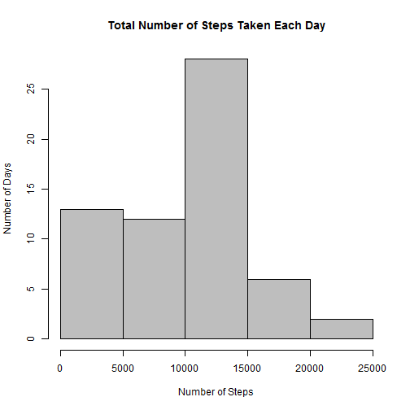
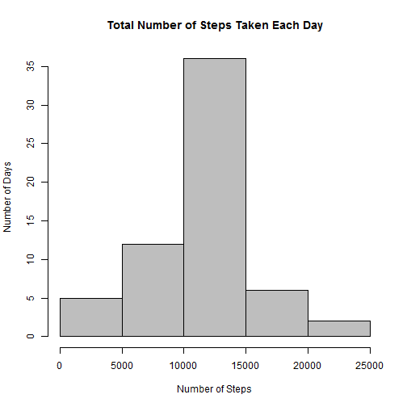
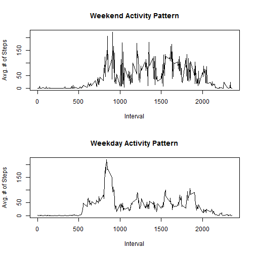

# Reproducible Research: Peer Assessment 1


## Loading and preprocessing the data
The file is unzipped, and loaded into a data frame.  The date column is converted to a 'Date' data type.

```r
unzip("activity.zip")
inDF <- read.csv("activity.csv", header = TRUE, colClasses = c("numeric", "character", 
    "numeric"))
inDF[, 2] <- as.Date(inDF[, 2], format = "%Y-%m-%d")
```


## What is mean total number of steps taken per day?

```r
agDF <- aggregate(inDF$steps, list(inDF$date), sum, na.rm = TRUE)
hist(agDF[, 2], col = "grey", main = "Total Number of Steps Taken Each Day", 
    xlab = "Number of Steps", ylab = "Number of Days")
```

 

```r
agMean <- mean(agDF[, 2])
agMedian <- median(agDF[, 2])
```


The mean and median values of the number of steps taken each day are as follows:
- Mean: 9354.2295
- Median: 1.0395 &times; 10<sup>4</sup>


## What is the average daily activity pattern?

```r
dailyAvgDF <- aggregate(inDF$steps, list(inDF$interval), mean, na.rm = TRUE)
colnames(dailyAvgDF) <- c("interval", "avgSteps")
plot(dailyAvgDF[, 1], dailyAvgDF[, 2], type = "l", main = "Average Daily Activity Pattern", 
    xlab = "Intervals", ylab = "Avg. # of Steps Taken")
```

 

```r
maxVals <- subset(dailyAvgDF, avgSteps == max(avgSteps))
```

The interval that contains the maximum number of steps, on average across all the days in the dataset is 835 and the maximum number of steps pertaining to this interval is 206.1698


## Imputing missing values
The number of rows with NA is calculated as follows:

```r
numNA <- sum(is.na(inDF[, 1]))
```

The number of rows with missing values is 2304

The missing values are filled in using the mean value across all dates for the corresponding time interval.

```r
newDF <- inDF
numIterations <- nrow(inDF)
for (i in 1:numIterations) {
    if (is.na(newDF[i, 1])) {
        tsInt <- inDF[i, 3]
        tempDF <- subset(dailyAvgDF, interval == tsInt)
        newDF[i, 1] <- tempDF[1, 2]
    }
}
agDF2 <- aggregate(newDF$steps, list(inDF$date), sum, na.rm = TRUE)
hist(agDF2[, 2], col = "grey", main = "Total Number of Steps Taken Each Day", 
    xlab = "Number of Steps", ylab = "Number of Days")
```

 

```r
agMean2 <- mean(agDF2[, 2])
agMedian2 <- median(agDF2[, 2])
```


The mean and median values of the number of steps taken each day, after filling in missing values are as follows:
- Mean: 1.0766 &times; 10<sup>4</sup>
- Median: 1.0766 &times; 10<sup>4</sup>


## Are there differences in activity patterns between weekdays and weekends?

```r
# add column for category variable weekend/weekday
newDF$dayname <- weekdays(newDF$date)
newDF$day <- ifelse(newDF$dayname == c("Saturday", "Sunday"), "weekend", "weekday")

# split the dataframe by weekday/weekend and aggregate by intervals
weekendDF <- subset(newDF, day == "weekend")
weekendAvgDF <- aggregate(weekendDF$steps, list(weekendDF$interval), mean, na.rm = TRUE)

weekdayDF <- subset(newDF, day == "weekday")
weekdayAvgDF <- aggregate(weekdayDF$steps, list(weekdayDF$interval), mean, na.rm = TRUE)

# plot the two graphs
par(mfrow = c(2, 1))
plot(weekendAvgDF[, 1], weekendAvgDF[, 2], type = "l", main = "Weekend Activity Pattern", 
    xlab = "Interval", ylab = "Avg. # of Steps")
plot(weekdayAvgDF[, 1], weekdayAvgDF[, 2], type = "l", main = "Weekday Activity Pattern", 
    xlab = "Interval", ylab = "Avg. # of Steps")
```

 

